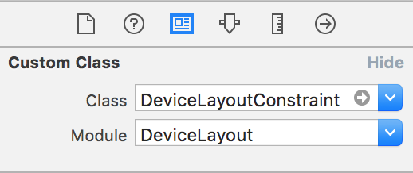
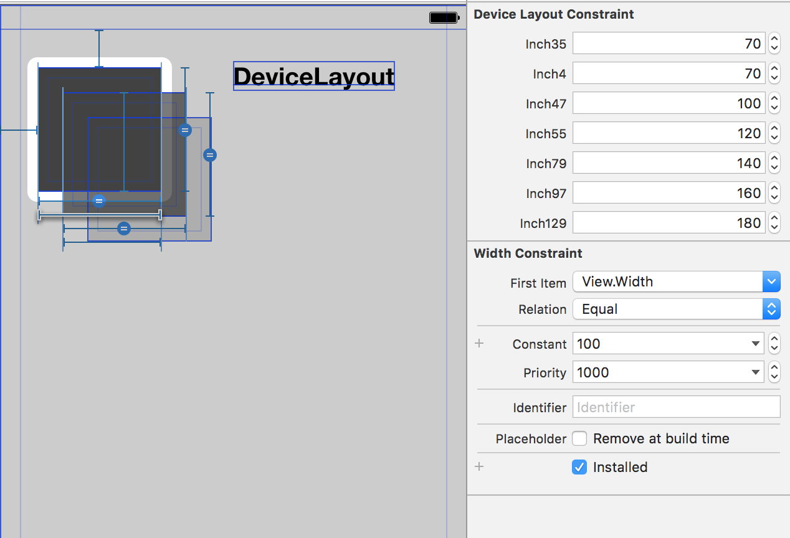

# DeviceLayout


[](https://github.com/cruisediary/DeviceLayout)

[](https://travis-ci.org/cruisediary/DeviceLayout)
[](http://cocoapods.org/pods/DeviceLayout)
[](http://cocoapods.org/pods/DeviceLayout)
[](http://cocoapods.org/pods/DeviceLayout)

**DeviceLayout** is a Swift framework that lets you set *Auto Layout* constraints's differently for each device

## Example





To run the example project, clone the repo, and run `pod install` from the Example directory first.

## Requirements

## Installation

DeviceLayout is available through [CocoaPods](http://cocoapods.org). To install
it, simply add the following line to your Podfile:

```ruby
pod "DeviceLayout"
```

## Author

cruisediary, cruzdiary@gmail.com

## License

DeviceLayout is available under the MIT license. See the LICENSE file for more info.
